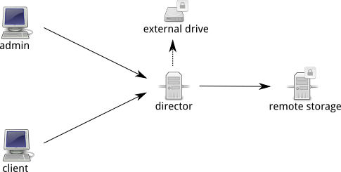

```bash
```

# DEMO: SAUVEGARDER SES FICHIERS AVEC BACULA

## PRÉ-REQUIS

Pour réaliser les étapes de cette démonstration, il faut préalablement se munir
de plusieurs outils:

* Un système d'exploitation de type Windows, Mac OSX ou GNU/Linux;
* VirtualBox ou libvirt;
* Vagrant;
* Git.

**Avertissement:** Comme l'installation de ces outils, dépend d'un système à
l'autre, seul la configuration de ces outils est couverte par ce document.

**Note:** Le support de `VMWare` par `vagrant` est payant. De ce fait, cette
solution n'est pas couverte par ce document.

### CONFIGURATION DE VAGRANT
Aussitôt que `vagrant` est installé, il faut le configurer de sorte qu'il puisse
interagir avec la solution de virtualisation.

Par défaut, `vagrant` fonctionne avec `VirtualBox`. Cependant il est nécessaire
d'installer un plugin qui permet l'ajout des 'Guest Additions'.

```bash
$ vagrant plugin install vagrant-vbguest
Installing the 'vagrant-vbguest' plugin. This can take a few minutes...
Installed the plugin 'vagrant-vbguest (0.13.0)'!
```

La simulation, prévoit une sauvegarde sur un disque externe. De ce fait, il
est nesessaire d'installer un plugin, permettant la création de volumes
virtuels.

```bash
$ vagrant plugin install vagrant-persistent-storage
Installing the 'vagrant-persistent-storage' plugin. This can take a few minutes...
Installed the plugin 'vagrant-persistent-storage (0.0.21)'!
```

### INSTALLATION DE L'INFRASTRUCTURE

**Avertissement:** Pour utiliser l'infrastructure, il est impératif que la
plage ip 192.168.33.0/24 ne soit pas déjà occupée.

```bash
$ git clone https://github.com/crabone/HEIGVD-AIT-2016-Talk-Bacula.git
$ cd HEIGVD-AIT-2016-Talk-Bacula/infra
$ vagrant up
```

## INFRASTRUCTURE



L'infrastructure est configurée de sorte, à ce ressembler au mieux, à une
installation, classique chez un particulier.

Hostname | IP | Role(s)
--- | --- | ---
director | 192.168.33.2 | Director, Catalog, External storage
storage | 192.168.33.3 | Remote storage
admin | 192.168.33.4 | Admin, Client
client | 192.168.33.5 | Client

On suppose deux postes clients, dont l'un administrateur de l'infrastructure.
Un serveur, qui est chargé d'orchestrer toute l'infrastructure. Et deux
supports de sauvegarde, l'un représentant un périphérique externe, l'autre un
serveur distant.

Par analogie, on imagine un utilisateur possédant un ordinateur de bureau, et
un ordinateur portable. Un petit seveur (raspberryPi) qui fait office de chef
d'orchestre, dont on est connecté un disque dur externe. Et d'un serveur
distant (de type Amazon p.e.).

## EXEMPLE D'UTILISATION

```bash
```

## AMELIORATIONS

* Définir un mot-de-passe pour la base de donnée SQLite3

## À PROPOS

* FRANCHINI Fabien (@crab_one)
* HENNEBERGER Sébastien (@Shen299)
* ROUILLER Bastien (@B2B_16)
